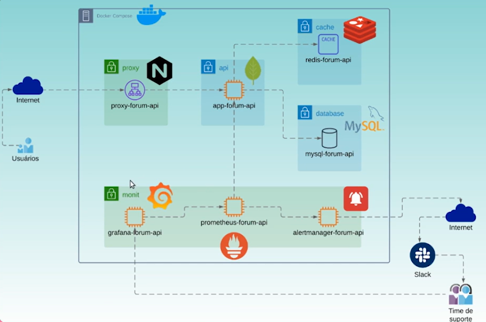

## Esquema da aplicação

## Comandos
- `docker-compose up` para iniciar os containers do Docker (executar no diretório em que se encontra o arquivo `docker-compose.yml`)

## Iniciando o Grafana
- Usuário e senha padrão do Grafana: _admin_
- 1º Configurar o data source
    - Prometheus: http://prometheus-forum-api:9090
- 2º Criar pasta para dashboards
- 3º Criar dashboard (acessar settings para definir título, descrição, tags e etc.)